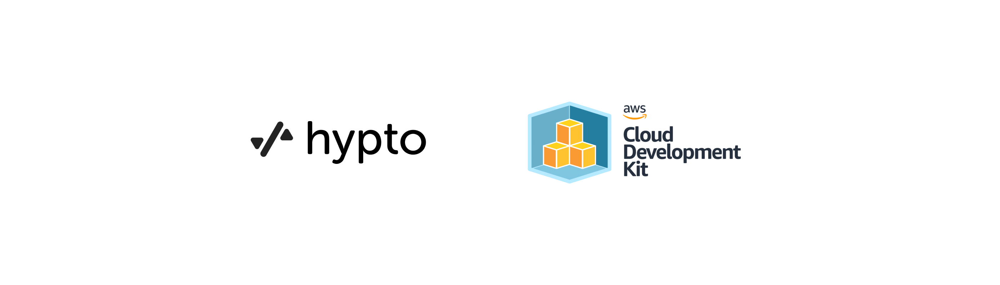

# App Infrastructure



## Overview

**App Infrastructure** using AWS and CDK.

AWS CDK Infrastructure package that creates:
1) Network Layer - Multi-AZ VPC with 3 subnets (1 public and 2 private-isolated)
2) Data Layer - Postgres Aurora database cluster and a Redis elasticache cluster
3) Service Layer - Fargate Service in an ECS cluster backed by an Application Load Balancer
4) CICD Layer - CodePipeline with 4 stages and a manual intervention.

## File organization

The infra sources are organized into the following files:

- [package.json](package.json): Package dependencies for npm
- [network-layer.ts](lib/network-layer.ts): Construct to create a multi-AZ VPC with 1 public and 2 private isolated subnets.
- [data-layer.ts](lib/data-layer.ts): Construct to create a postgres aurora database cluster and a redis elasticache cluster.
- [fargate-service-layer.ts](lib/service-layer/fargate-service-layer.ts): Construct to create an ECS cluster with an ApplicationLoadBalancedFargateService with a validated DNS certificate.
- [cicd-layer.ts](lib/deployment-layer.ts): Construct to create a CodePipeline with a Source, CodeBuild, ManualApproval and ECSDeploy stages.
- [stack.ts](bin/stack.ts): Stack that creates above 4 constructs in the right order.

## Set up your own AWS and deploy the resources from your macOS

<details>
  <summary>Install Homebrew</summary>

Download and install Homebrew:

  ```sh
  /bin/bash -c "$(curl -fsSL https://raw.githubusercontent.com/Homebrew/install/HEAD/install.sh)"
  ```
</details>

<details>
  <summary>Install nvm</summary>

Install latest version of nvm:

  ```sh
  brew install nvm
  ```
</details>
<details>
  <summary>Install any version of Node</summary>

Install latest version of node:

  ```sh
  nvm install node
  ```

or any specific version of node:

  ```sh
  nvm install 14.17.6
  ```
</details>
<details>
  <summary>Install CDK</summary>

Follow the instructions from [AWS CDK Getting Started](https://docs.aws.amazon.com/cdk/latest/guide/getting_started.html#getting_started_prerequisites)
to configure your AWS account and install CDK

</details>
<details>
  <summary>Run a clean initialization</summary>

Run a custom clean build command (installing dependencies is handled part of the command)

  ```sh
  npm run clean
  ```

Install npm dependencies

  ```sh
  npm install
  ```

</details>
<details>
  <summary>Deploy & Destroy on AWS</summary>

To deploy the stack with all 4 constructs, run:

  ```sh
  cdk deploy
  ```

To destroy the stack, run:

  ```sh
  cdk destroy
  ```

</details>